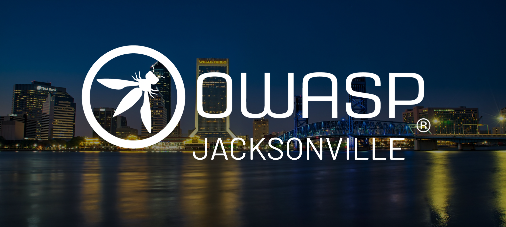

---

layout: col-sidebar
title: OWASP Jacksonville
region: North America
meetup-group: OWASP-Jacksonville-Chapter
country: USA
postal-code: 32257

---

# **Welcome to OWASP Jacksonville, FL!**

OWASP Jacksonville provides like minded professionals a meeting place to share, collaborate and interact with other IT security personel.  Whether you are new to IT security or a well seasoned veteran, OWASP Jacksonville provides a great networking environment to apply to everyone. 

Our meetings are offered on the **3rd Monday of every month** in room 5 at Star-V  7020 A C Skinner Pkwy UNIT 180, Jacksonville, FL 32256.  
Please note that there are 3 entrances; only the one perpendicular to the main street is unlocked after 5pm ET. Please use the side entrance as seen in the picture below.
  
     

If you are interested in facilitating a discussion or passionate on a topic you would like to present, reach out to [Francois Fried](mailto:francois.fried@owasp.org) to schedule a topic.
 
## **Who is OWASP?**

OWASP Foundation is a professional association of global members and is open to anyone interested in learning more about software security.  Local chapters are run independently and guided by the Chapter_Leader_Handbook.  As a 501(c)(3) non-profit professional association your support and sponsorship of any meeting venue and/or refreshments is tax-deductible.  Financial contributions should only be made online using the authorized online chapter donation site [Donate](https://owasp.org).  To be a SPEAKER at ANY OWASP Chapter in the world simply review the speaker agreement and then contact the local chapter leader with details of what OWASP PROJECT, independent research or related software security topic you would like to present on.

## Next Meeting/Event <!-- You should keep this section as it will populate your meetup events -->



6:30pm -8:00pm - [Meeting](https://www.meetup.com/OWASP-Jacksonville-Chapter/)
 
## Chapter Supporters
[Star V Learning Centers](https://starv.tech)

  

## Past Meetings Recording:

Recordings are uploaded to the drive within 48hrs from the meeting! 

[Google Drive Link](https://drive.google.com/drive/folders/1avY3oauAiB-Fvfe-S4m2VwITHlfP5Izf)