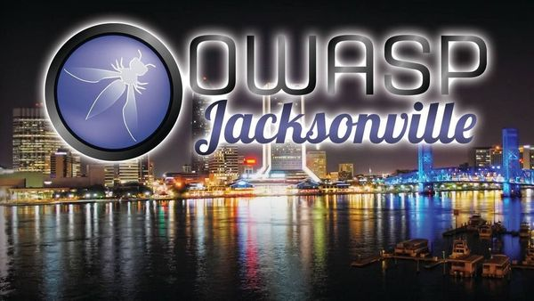

---

layout: col-sidebar
title: OWASP Jacksonville
region: North America
meetup-group: OWASP-Jacksonville-Chapter
country: USA
postal-code: 32257

---

# **Who is OWASP**

OWASP Foundation is a professional association of global members and is open to anyone interested in learning more about software security.  Local chapters are run independently and guided by the Chapter_Leader_Handbook.  As a 501(c)(3) non-profit professional association your support and sponsorship of any meeting venue and/or refreshments is tax-deductible.  Financial contributions should only be made online using the authorized online chapter donation site [Donate](https://owasp.org).  To be a SPEAKER at ANY OWASP Chapter in the world simply review the speaker agreement and then contact the local chapter leader with details of what OWASP PROJECT, independent research or related software security topic you would like to present on.

### **Welcome to OWASP Jacksonville, Fl**

Owasp Jacksonville provides like minded professionals a meeting place to share, collaborate and interact with other IT security personel.  Whether you are new to IT security or a well seasoned veteran, OWASP Jacksonville provides a great networking environment to apply to everyone. 

Our meetings are offered on the **2nd Monday of every month**. Our meetings are currently [virtual](https://training.secureideas.com/course/owasp-jax-meeting/). Thanks to our sponsors at [Secure Ideas](https://secureideas.com).

<a class='timeclass'>19:00pm - 20:30pm - [Meeting](https://www.meetup.com/OWASP-Jacksonville-Chapter/)</a>




{{event.name}}

Check our Upcoming Meetup Events:


As we enter the new year we are looking to find new ways to bring knowledge of application security to the community.  If you are interested in facilitating a discussion or passionate on a topic you would like to present, reach out to [Larry Franklin](mailto:larry.franklin@owasp.org) to schedule a topic.

If you haven't signed up for a community OWASP group request access today.  [Community Group](https://groups.google.com/a/owasp.org/forum/#!forum/jacksonville-chapter)

## Meeting Supporters

 Secure Ideas, Robert Half Technology Jacksonville

#### Previous and upcomimg meetings:

October 8, 2018 - Brandi Kiehl Topic: WordClouds

November 12, 2018 - Dr Johannes Ullrich Topic: Nation State Level Honeypotting: Emulating Vulnerable Web Applications at Scale [Video link](https://youtu.be/2anqrtfJ1nA)

December 10 - OWASP Jax social ** Cancelled **

January 14, 2019 - Guest Speaker Oleg Laskin , Password Cracking [Video link](https://www.youtube.com/watch?v=Sz2IayEfuBg&t=741s)

February 11, 2019 - Guest Speaker Michael Marbut, Everything you want to know about passwords but we're too afraid to ask: a beginners guide to password hashing [Video link](https://youtu.be/prhE150EiI4)

March 11, 2019 - Guest Speaker David Fekke, this presentation will cover the BlackBerry Dynamics framework, what it can provide for mobile and enterprise security. This presentation will include a demo of a iOS application built with BlackBerry Dynamics. 

April 8, 2019 - Nawwar Kabbani - Modern authentication and authorization with OAUTH 2.0 and OpenID Connect

May 13, 2019 - Guest Speaker Lev Shaket - GatsbyJs and AWS Lambda // Statically generate passphrases with dreidelware.org

June 10, 2019 - Guest speaker Travis Phillips - Pwntools

July 8, 2019 - Kevin Johnson CEO and owner of Secure Ideas LLC, - OWASP WishBook, an incite into OWASP projects and how you can contribute.

August 12, 2019 - Martin Knobloch Chairman of the Board OWASP Foundation - Security in a DevOps world with OWASP tools & guides

September 9, 2019 - Michael Marbut - Interactive presentation on OWASP's Juice Shop.

October 14,2019 - Michael Dimmett - "How the web works" and using chrome development tools to reverse engineer undocumented parts the youtube embed api. 

November 11, 2019 - Meeting cancelled due to Veterans Day

December 9, 2019 - OWASP Chapter Leaders - Planning for the new year

January 13, 2020 - Michael Marbut - OSINT

February 10, 2020 - Jonah Goldsmith -PCI via OWASP 

March 9, 2020 - Paul Meharg - (Sonatype) AppSec and Opensource tool Management 

**April 13, 2020 - All meeting are on-hold due to Covid-19 social distancing 

August 10, 2020 - Hosted online

September 14, 2020 - Hosted online slides available at [video link](https://aombbb2020.academyofmine.net/playback/presentation/2.0/playback.html?meetingId=c5bb0e1eb7f6cdb87cb1632d32927ff779b220bc-1600121782941)

October 12. 2020 - Hosted online Travis Phillips https://training.secureideas.com/course/owasp-jax-meeting/

December 2020 - February 2021 meetings on hold

March 8, 2021 - Meeting cancelled due to technical difficulties

April 12, 2021 - Christian McLaughlin - OSINT Tools Hosted online available recording at [video link](https://aombbb2020.academyofmine.net/playback/presentation/2.0/playback.html?meetingId=2486e7b8421bdd70892872e096f5d617abf5bec1-1618264657202)

May 10, 2021 - Keith Perry - OSINT of Potential Business Partners and acquisitions Google meet at meet.google.com/ojq-gvsr-tjd

June 14, 2021 - Mic Whitehorn-Gillam - Run what you brung": An intro to app testing with only the browser. [video link](https://youtu.be/xyjcGIIItGA)

July 12, 2021 - Jennifer Shannon - Exploring Exploit Kits - Exploring exploit kits through PCAPS
